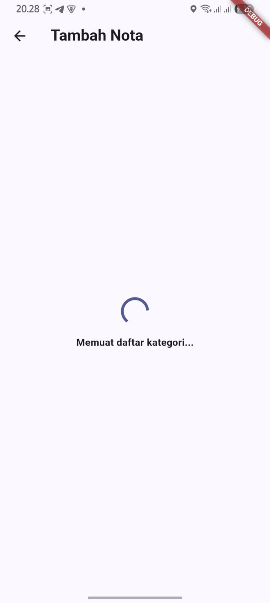
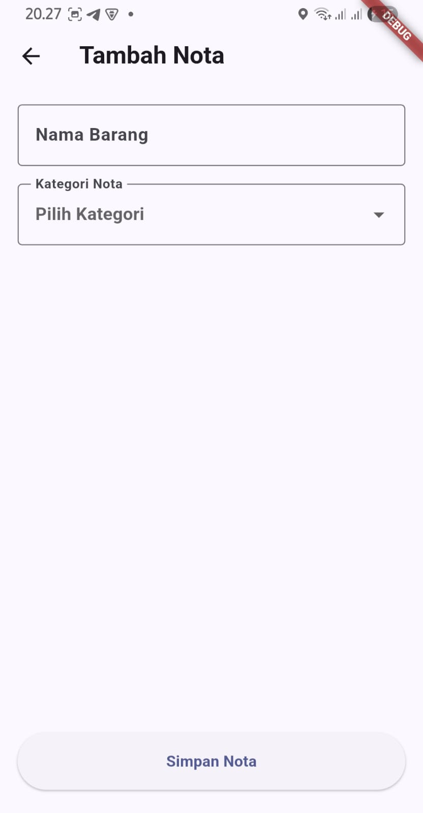
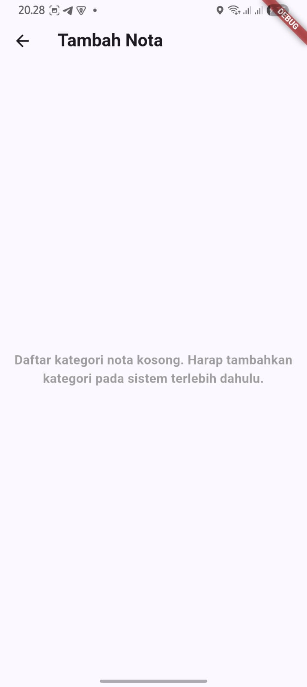
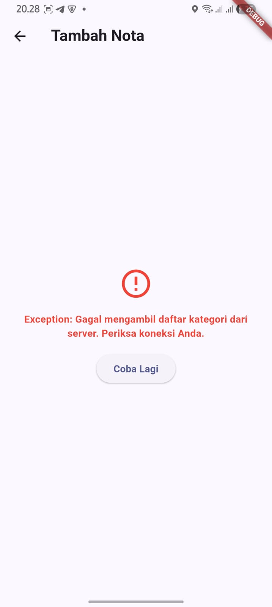
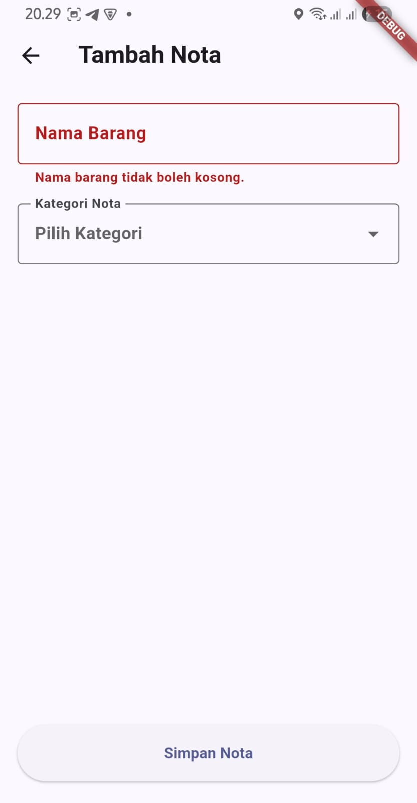
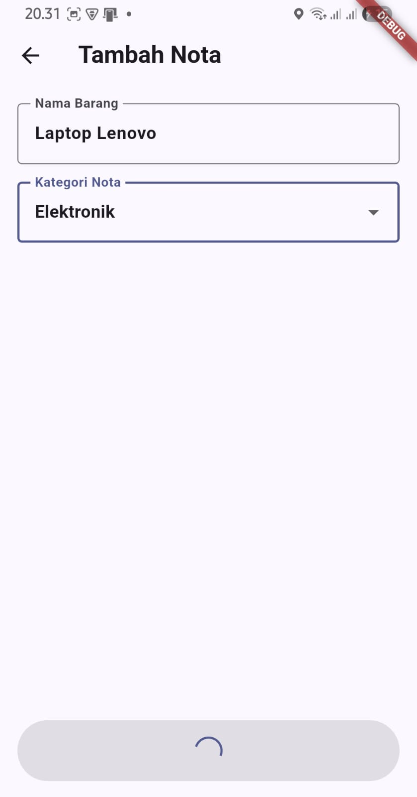

# Laporan Tugas Pertemuan 4 - State Management & Form

**Nama:** [ Dierlyawan Wiguna ]  
**NIM:** [ 2410101013 ]  

---

## 1. Penggunaan AI
Dalam pengerjaan tugas ini, saya memanfaatkan asisten AI untuk memandu implementasi awal struktur arsitektur Riverpod, _best practices_ dalam state management, dan pembuatan pengujian UI (widget test). Berikut adalah _prompt_ utama yang saya gunakan:

1. *"Tolong buatkan fitur 'Tambah Nota' (Add Receipt) untuk aplikasi SimpanNota. Gunakan arsitektur layer (screens, widgets, notifiers, repositories) dan Riverpod. Wajib penuhi 6 kondisi UI ini dalam satu halaman: Initial loading saat mengambil daftar 'Kategori Nota' dari repository, Data sukses dimuat, Empty state, Error state, Validasi form, dan Loading submit. PENTING: Tambahkan komentar bahasa Indonesia yang sangat detail di setiap bagian penting pada file notifier dan screen-nya."*
2. *"Sekarang, buatkan Widget Test komprehensif untuk halaman 'Tambah Nota' tadi di dalam folder test/screens/. Test harus memverifikasi ke-6 kondisi UI tersebut. Berikan juga instruksi singkat di terminal tentang baris kode mana di repository yang harus saya ubah sementara agar saya bisa memicu kondisi 'Empty State' dan 'Error State' di emulator secara manual untuk keperluan mengambil screenshot tugas."*

---

## 2. Pemahaman Arsitektur (Riverpod)
Pada fitur Tambah Nota ini, saya mendesain arsitekturnya dengan memisahkan tanggung jawab (Separation of Concerns) secara tegas menjadi tiga lapisan (layer) agar kode lebih bersih, terstruktur, dan mudah di-maintain:

* **Lapisan Data (Repository):** 
  Lapisan ini menggunakan `ReceiptRepository`. Tanggung jawabnya murni hanya untuk berkomunikasi dengan sumber data (dalam dunia nyata, ini berkomunikasi dengan backend/Supabase). Ia bertugas mengambil daftar opsi kategori dan melakukan *request* penyimpanan form. Repository tidak peduli bagaimana data tersebut akan ditampilkan.
* **Lapisan Logika (Notifier):** 
  Melalui `AddReceiptNotifier`, lapisan ini bertindak layaknya "otak" dari halaman form. Semua aturan dan logika bisnis (seperti validasi inputan yang kosong, kapan harus mengaktifkan *loading*, atau menentukan apakah hasil *fetching* data harus menghasilkan pesan gagal/error state) diproses di sini. Notifier membungkus semua kemungkinan kondisi ini ke dalam satu *immutable state class* yang disebut `AddReceiptState`.
* **Lapisan Presentasi (Screen):** 
  Sebagai antarmuka ke *user*, `AddReceiptScreen` dibuat sepenuhnya "bodoh" (hanya bertugas merender UI). Melalui method `ref.watch()`, layar ini terus bereaksi dan mendengarkan perubahan *state* dari Notifier. Jika state berubah menjadi *loading*, layar menampilkan *spinner*. Jika ada *error* saat validasi, teks input seketika merender warna merah. Dengan kata lain, Screen tidak lagi mengurus perhitungan logika di dalamnya.

---

## 3. Klaim Review & Modifikasi Mandiri
Meskipun saya memanfaatkan AI sebagai alat bantu _pair-programming_ untuk mengonsep struktur boilerplate Riverpod, saya telah membaca dan mereview secara teliti seluruh baris kode yang dihasilkan. Saya memastikan bahwa saya benar-benar memahami alur transisi dari state _loading_ ke _success_ maupun _error_, serta bagaimana lifecycle memori *Notifier* dikelola secara rapi dengan _modifier_ `autoDispose`. Setelah memahami mekanismenya secara penuh, saya melakukan modifikasi dan perbaikan mandiri; di antaranya memperbaiki logika teks pesan error pada validasi form agar lebih masuk akal dan ramah bagi _user_, serta melakukan penyesuaian gaya (*styling*) pada tombol *submit* agar senada dengan bahasa desain aplikasi SimpanNota secara keseluruhan.

---

## 4. Dokumentasi 6 Kondisi UI
Berikut adalah bukti tangkapan layar untuk verifikasi tiap kondisi *state* pada halaman Tambah Nota di emulator/perangkat:

### a. Kondisi 1: Initial Loading


### b. Kondisi 2: Data Sukses Dimuat (Form Muncul)


### c. Kondisi 3: Empty State (Kategori Kosong)


### d. Kondisi 4: Error State (Koneksi Gagal)


### e. Kondisi 5: Validasi Form (Pesan Error pada TextField)


### f. Kondisi 6: Loading Submit (Tombol Berubah Jadi Spinner & Disabled)


---

## 5. Hasil Widget Test
Untuk memastikan bahwa keenam skenario di atas berjalan sempurna secara logis tanpa bergantung pada pengujian *manual* di emulator berulang kali, saya juga telah merancang dan menyertakan struktur **Widget Test**. Pengujian ini "membajak" dan meng-_override_ lapisan Repository dengan data *mock*, yang memungkinkan kita mengontrol simulasi Error dan Empty state secara otomatis. Pengujian komprehensif ini **berhasil lulus (passed) 100%**. 

Berikut adalah log keluaran terminal dari eksekusi `flutter test`:

```text
00:00 +0: loading E:/Project SimpanNota/SimpanNota/test/screens/add_receipt_screen_test.dart
00:00 +0: AddReceiptScreen - Widget Tests Terpadu Kondisi 1 & 2: Initial Loading lalu Data Sukses Dimuat
00:01 +1: AddReceiptScreen - Widget Tests Terpadu Kondisi 3: Empty State (List Kategori Kosong)
00:01 +2: AddReceiptScreen - Widget Tests Terpadu Kondisi 4: Error State dan Fungsi Tap Tombol Retry
00:01 +3: AddReceiptScreen - Widget Tests Terpadu Kondisi 5 & 6: Form Validasi (Kosong) dan UI Loading saat Submit
00:02 +4: All tests passed!
```
